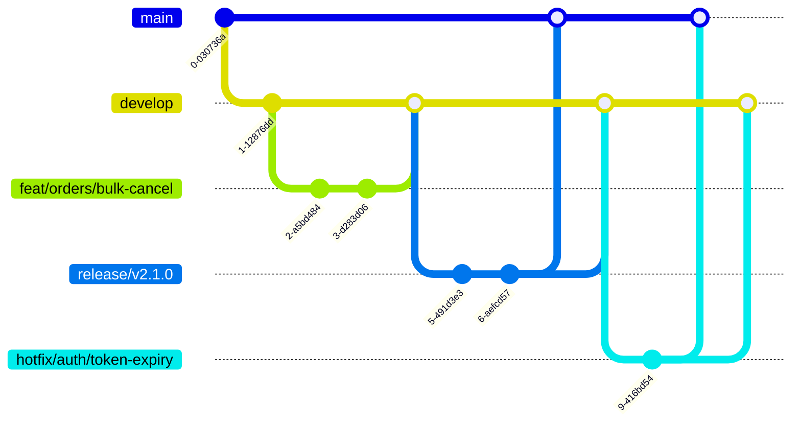

# Branch Strategy

## Branching Model

The project uses a **trunk-based development** model with short-lived feature branches:

```
main
  ▲
  │
release/v2.1.0 ──────► main
  ▲
  │
develop ─────────────► release/v2.1.0
  ▲            ▲
  │            │
feat/orders/  hotfix/auth/
bulk-cancel   token-expiry
```

## Branch Hierarchy

### `main` (Protected)
- **Purpose**: Production-ready code. What's running in production.
- **Source**: Merged from `release/*` or `hotfix/*`
- **Protection**: Requires PR review, CI pass, signed commits
- **Never**: Commit directly, rebase, force push

### `develop` (Protected)
- **Purpose**: Integration branch for completed features.
- **Source**: Merged from `feat/*`, `fix/*`, `refactor/*`, etc.
- **Protection**: Requires PR review, CI pass
- **Never**: Commit directly, rebase, force push

### `release/v{major}.{minor}.{patch}`
- **Purpose**: Release candidate preparation and stabilization.
- **Source**: Cut from `develop`
- **Lifetime**: Duration of release testing (1-3 days)
- **Merges to**: `main` and back to `develop`
- **Only**: Bug fixes, version bumps, changelog updates

### `feat/scope/description`
- **Purpose**: New features and improvements.
- **Source**: Branched from `develop`
- **Lifetime**: Maximum 5 days
- **Merges to**: `develop` via squash merge
- **Naming**: `feat/scope/feature-name`

### `fix/scope/description`
- **Purpose**: Bug fixes.
- **Source**: Branched from `develop`
- **Lifetime**: Maximum 3 days
- **Merges to**: `develop` via squash merge
- **Naming**: `fix/domain/bug-description`

### `hotfix/scope/description`
- **Purpose**: Critical production fixes (P0/P1).
- **Source**: Branched from `main`
- **Lifetime**: Maximum 24 hours
- **Merges to**: Both `main` and `develop`
- **Naming**: `hotfix/domain/issue-description`

### `refactor/scope/description`
- **Purpose**: Code restructuring without behavior change.
- **Source**: Branched from `develop`
- **Lifetime**: Maximum 3 days
- **Merges to**: `develop` via squash merge
- **Naming**: `refactor/domain/what-is-refactored`

### `docs/scope/description`
- **Purpose**: Documentation-only changes.
- **Source**: Branched from `develop`
- **Lifetime**: Maximum 2 days
- **Merges to**: `develop` via squash merge

## Branch Lifecycle

```
Created → Active (development) → PR Opened → Reviewed → Merged → Deleted
```

### Guidelines

1. **Short-lived branches**: Maximum 5 days. Longer branches cause merge conflicts and integration pain.
2. **One feature per branch**: Don't mix features in one branch. Each PR should do one thing.
3. **Keep branches up to date**: Rebase or merge from `develop` daily to avoid conflicts.
4. **Delete after merge**: Once merged, delete the branch locally and on remote.
5. **No direct commits to protected branches**: Always use PRs for `main`, `develop`, and `release/*`.

## Branch Protection Rules

### `main`
- Require PR with minimum 1 approval
- Require CI status checks
- Require signed commits
- Require linear history (no merge commits)
- Include administrators
- Block force pushes

### `develop`
- Require PR with minimum 1 approval
- Require CI status checks
- Include administrators
- Block force pushes

### `release/*`
- Require PR with minimum 1 approval
- Require CI status checks
- Include administrators
- Block force pushes

## Visual Workflow



## Conflict Resolution

```bash
# When your branch has merge conflicts with develop:
git checkout feat/orders/my-feature
git fetch origin develop
git rebase origin/develop

# Resolve conflicts in your IDE
# After resolving:
git add .
git rebase --continue

# Force push (since rebase rewrites history)
git push --force-with-lease origin feat/orders/my-feature
```
