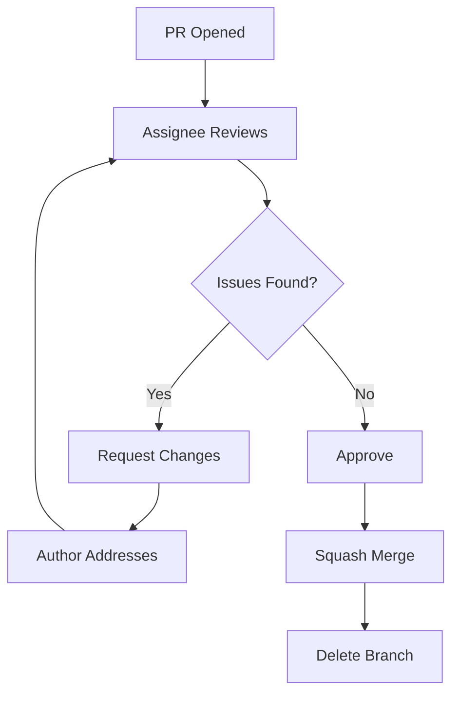

# Code Review Checklist

## Overview

Every pull request must pass code review before merging. Reviews focus on correctness, security, performance, maintainability, testing, and style. The reviewer is responsible for verifying that the code meets project standards and will not introduce regressions or vulnerabilities.

## Reviewer Responsibilities

1. **Respond within 4 hours** for first review pass
2. **Complete review within 24 hours** of assignment
3. **Verify functionality** — does the code do what it claims?
4. **Check edge cases** — what happens when things go wrong?
5. **Enforce standards** — does the code follow RULES.md?
6. **Mentor** — provide constructive feedback, not just criticism
7. **Approve only when ready** — no rubber-stamping

## Blocking vs Non-Blocking Issues

| Severity | Label | Action |
|----------|-------|--------|
| Blocking | `blocking` | Must be fixed before merge |
| Advisory | `advisory` | Should be addressed, but doesn't block |
| Nitpick | `nit` | Personal preference, author can decide |
| Question | `question` | Clarification needed before approval |

## Correctness Checklist

- [ ] Code matches the requirements and acceptance criteria
- [ ] All states handled: loading, empty, error, success
- [ ] Edge cases handled: null, undefined, empty arrays, boundary values
- [ ] Error conditions handled gracefully with user-friendly messages
- [ ] State transitions are valid (e.g., order status changes)
- [ ] Concurrency handled (optimistic locking, idempotency)
- [ ] Idempotency implemented for mutation endpoints
- [ ] Race conditions considered and mitigated
- [ ] Data validation at all boundaries (API, database, UI)
- [ ] Backward compatibility maintained (or migration path defined)

## Security Checklist

- [ ] Authentication required for protected endpoints
- [ ] Authorization enforced (role/permission checks)
- [ ] Input validation with Zod at API boundary
- [ ] No secrets or credentials in code
- [ ] No SQL/NoSQL injection vulnerabilities
- [ ] No XSS vulnerabilities (user content encoded)
- [ ] No sensitive data in error responses
- [ ] Rate limiting applied
- [ ] CORS configuration verified
- [ ] HTTP security headers properly configured
- [ ] No `eval()`, `Function()`, or dynamic imports
- [ ] File upload secured (type, size, content validation)

## Performance Checklist

- [ ] Database queries use indexes (verified with `explain()`)
- [ ] No N+1 query patterns
- [ ] `.lean()` used for all read queries
- [ ] Pagination implemented for list endpoints
- [ ] Projections limit fields returned
- [ ] No blocking operations in request handlers
- [ ] Async/await for all I/O operations
- [ ] Batch operations replace loops for DB writes
- [ ] Mobile: FlatList over ScrollView for lists > 10
- [ ] Mobile: React.memo, useCallback, useMemo applied correctly
- [ ] Mobile: Image optimization (expo-image, WebP, CDN)

## Maintainability Checklist

- [ ] Single Responsibility Principle followed
- [ ] Function size < 40 lines
- [ ] File size < 400 lines
- [ ] Nesting depth < 4 levels
- [ ] Cyclomatic complexity < 10 per function
- [ ] Meaningful variable and function names
- [ ] No dead code or commented-out code
- [ ] No magic numbers or strings (named constants)
- [ ] No duplicate code (DRY principle)
- [ ] Error messages are user-friendly and actionable
- [ ] Error messages are not hardcoded (use constants/enums)
- [ ] Imports follow the standard order
- [ ] No circular dependencies
- [ ] No `console.log`, `debugger`, `TODO`, `FIXME`, `HACK`

## Testing Checklist

- [ ] Unit tests cover: happy path, error conditions, edge cases
- [ ] Integration tests cover: endpoint success and failure scenarios
- [ ] Test coverage >= 85% (lines) and >= 75% (branches)
- [ ] Tests are independent (no shared state)
- [ ] No network calls in unit tests
- [ ] Test descriptions follow: `[Method] [action] [expected result]`
- [ ] Test data uses factories, not static fixtures
- [ ] Mocks verify expected arguments
- [ ] New features have corresponding test additions
- [ ] Bug fixes have regression tests

## Documentation Checklist

- [ ] OpenAPI spec updated for new/modified endpoints
- [ ] CHANGELOG.md updated (if applicable)
- [ ] Environment variables documented in `.env.example`
- [ ] Migration scripts documented (up + down)
- [ ] ADR updated if architecture changed
- [ ] README updated if setup/configuration changed
- [ ] JSDoc added for exported functions

## PR Quality Checklist

- [ ] PR title follows Conventional Commits format
- [ ] PR description includes: what, why, how, testing evidence
- [ ] Branch is up to date with target branch
- [ ] Branch name follows convention: `type/scope/description`
- [ ] Commit messages follow Conventional Commits
- [ ] No merge commits in feature branch
- [ ] PR size is reasonable (< 500 lines changed)
- [ ] CI pipeline passes

## Review Process



## Review Comments Format

```
[file:path/file.ts:line]
[severity] [message]

For blocking issues, include a suggested fix:

```suggestion
// Suggested code change
```
```

### Example Comment

```
[file:backend/src/services/order.service.ts:45]
[blocking] Missing input validation for orderId parameter

The orderId comes from user input (URL param) but isn't validated
before being used in a database query. Add a Zod schema check.

```suggestion
const getOrderSchema = z.object({
  id: z.string().length(24),
});
const { id } = getOrderSchema.parse(req.params);
```
```

## Approval Criteria

A PR may be approved when:

- [ ] All blocking issues resolved
- [ ] Advisory issues acknowledged (not necessarily fixed)
- [ ] CI pipeline passes
- [ ] Author has responded to all questions
- [ ] No unresolved security concerns
- [ ] Test coverage meets minimum thresholds
- [ ] Documentation is current
