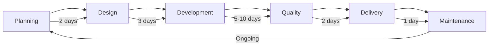

# Development Workflow

## Daily Schedule

```yaml
09:00 - 09:15: Standup
  - What I worked on yesterday
  - What I'm working on today
  - Blockers (if any)

09:15 - 12:00: Focused work
  - Deep work on assigned tickets
  - No meetings during this block

12:00 - 13:00: Lunch

13:00 - 14:00: Review block
  - Review open PRs assigned to you
  - Goal: First review pass within 4 hours

14:00 - 16:30: Focused work
  - Continue implementation
  - Write tests
  - Update documentation

16:30 - 17:00: End-of-day
  - Status update in project tracker
  - Commit and push work
  - Prepare for next day
```

## Feature Development Flow

### 1. Design Phase

**Input**: User story with acceptance criteria

**Steps:**
1. Architect creates ADR for significant changes
2. Database designs schema and migrations
3. UI/UX creates mockups for UI changes
4. API defines OpenAPI contract (spec-first)
5. Security reviews threat model

**Output**: ADR, schema, mockups, OpenAPI spec, threat model

**Exit criteria:**
- [ ] Design approved by architect
- [ ] No unmitigated security threats
- [ ] All artifacts available

### 2. Development Phase

**Input**: Design artifacts approved

**Steps:**
1. Create feature branch from `develop`
2. Write tests first (TDD where practical)
3. Implement business logic in service layer
4. Create controller with validation
5. Register routes with middleware
6. Run lint and typecheck
7. Open pull request

**Code Structure:**

```typescript
// 1. Service layer — pure business logic
export class OrderService {
  constructor(
    private readonly orderRepository: IOrderRepository,
    private readonly eventBus: IEventBus,
  ) {}

  async createOrder(dto: ICreateOrderDTO, customerId: string, correlationId: string): Promise<IOrder> {
    const order = await this.orderRepository.create({
      ...dto,
      customerId,
      status: OrderStatus.PENDING,
      version: 1,
    });
    await this.eventBus.publish('order.created', { orderId: order._id });
    return order;
  }
}

// 2. Controller — thin, delegates to service
export const createOrder = async (req: Request, res: Response, next: NextFunction) => {
  try {
    const order = await orderService.createOrder(req.body, req.user!.id, req.correlationId);
    res.status(201).json({ success: true, data: order, correlationId: req.correlationId });
  } catch (error) {
    next(error);
  }
};

// 3. Routes — middleware chain
router.post('/', authenticate, validate(createOrderSchema), createOrder);

// 4. Validation — Zod schema
export const createOrderSchema = z.object({
  restaurantId: z.string().length(24),
  items: z.array(orderItemSchema).min(1).max(50),
  deliveryAddress: addressSchema,
});
```

**Exit criteria:**
- [ ] Feature implemented per design
- [ ] Unit tests passing (85%+ coverage)
- [ ] Integration tests passing
- [ ] Lint & typecheck — zero errors
- [ ] PR opened with complete description

### 3. Quality Phase

**Input**: PR opened

**Steps:**
1. CI runs automated checks (lint, typecheck, tests, build)
2. Code reviewer reviews (correctness, security, performance, style)
3. QA executes test plan (manual exploratory testing)
4. Performance benchmarks verified
5. Security scan passes
6. PR merged to `develop`

**Exit criteria:**
- [ ] CI all checks pass
- [ ] Code review approved (min 1 reviewer)
- [ ] QA signed off
- [ ] Performance verified (no regression > 10%)
- [ ] Security scan clean
- [ ] PR merged to develop

### 4. Delivery Phase

**Input**: Develop branch stable

**Steps:**
1. Release branch cut from `develop`
2. Version bumped
3. CHANGELOG.md updated
4. Staging deployment and smoke tests
5. Production deployment (rolling)
6. Git tag and release notes

**Exit criteria:**
- [ ] Production deployment successful
- [ ] Health check passes
- [ ] Error rates normal
- [ ] Release notes published

## Phase Transitions



## Emergency Workflow (Hotfix)

For P0 production issues:

```yaml
steps:
  1: "Branch from main: hotfix/auth/token-expiry"
  2: "Apply fix with minimal code change"
  3: "Write regression test"
  4: "CI builds and tests"
  5: "Skip full QA — focus on fix area"
  6: "Manual approval from architect (asynchronous)"
  7: "Deploy to production immediately"
  8: "Merge hotfix to main and develop"
  9: "Post-mortem within 24 hours"
```

## Development Standards

### Communication
- All decisions documented in tickets, not just conversations
- Blockers communicated within 1 hour of identification
- PR reviews responded to within 4 hours
- Status updates at end of each day

### Quality
- Lint and typecheck before every commit
- Tests written before or alongside implementation
- Documentation updated in same PR as code
- Self-review PR before requesting external review

### Collaboration
- Ask questions early — don't stay blocked
- Share knowledge through PR comments and documentation
- Pair on complex features or unfamiliar areas
- Rotate review assignments for knowledge sharing
