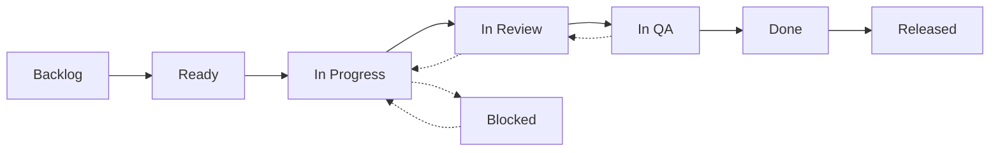

# Sprint Workflow

## Sprint Cadence

| Day | Activity | Duration |
|-----|----------|----------|
| Monday (Day 1) | Sprint Planning | 2 hours |
| Days 2-9 | Development & Review | Standard days |
| Friday (Day 10) | Sprint Review & Retrospective | 2.5 hours |

## Sprint Ceremonies

### Sprint Planning (Day 1, 09:00-11:00)

**Attendees**: Product Manager, Planner, Development Team, Architect, QA

**Agenda:**
1. Review sprint goal and priorities (15 min)
2. Walk through backlog items with acceptance criteria (30 min)
3. Estimate unestimated items (30 min)
4. Assign tickets to team members (15 min)
5. Confirm sprint capacity and commitments (15 min)
6. Document sprint goal and dependencies (15 min)

**Output:**
- Sprint backlog with assigned tickets
- Sprint goal statement
- Identified dependencies and risks

### Daily Standup (09:00-09:15)

**Format** (async or synchronous):
- What I worked on yesterday
- What I'm working on today
- Blockers (if any)

**Rules:**
- Keep under 15 minutes
- No problem-solving during standup — take it offline
- Update ticket status before standup
- Async option for distributed teams

### Mid-Sprint Check-in (Day 5, 15:00-15:30)

**Purpose:**
- Review progress against sprint goal
- Identify at-risk tickets
- Adjust scope if needed
- Address blockers

**Decisions:**
- Descope tickets that won't complete
- Reassign blocked tickets
- Add resources to critical path items

### Sprint Review (Day 10, 09:00-10:00)

**Attendees**: Team, Product Manager, Stakeholders, Architect

**Agenda:**
1. Demo completed work (30 min)
2. Review sprint metrics (10 min)
3. Stakeholder feedback (15 min)
4. Update backlog based on feedback (5 min)

**Output:**
- Demo of working software
- Stakeholder feedback documented
- Backlog adjustments

### Sprint Retrospective (Day 10, 10:00-11:00)

**Format**: Start-Stop-Continue or 4Ls (Liked, Learned, Lacked, Longed For)

**Agenda:**
1. Review sprint data (velocity, completed vs planned, bug ratio) (10 min)
2. Team discussion — what went well, what to improve (30 min)
3. Prioritize improvement items (10 min)
4. Create action items with owners and deadlines (10 min)

**Output:**
- Action items with owners and deadlines
- Updated team norms (if applicable)
- Identified process improvements for next sprint

## Sprint Artifacts

| Artifact | Owner | Description |
|----------|-------|-------------|
| Sprint Backlog | Planner | Tickets assigned to sprint with estimates |
| Sprint Goal | Product Manager | One-sentence goal for the sprint |
| Burndown Chart | Planner | Track remaining work vs time |
| Velocity Report | Planner | Story points completed vs committed |
| Test Coverage Report | QA | Coverage metrics for sprint changes |
| Performance Report | Performance | Performance metrics before/after |
| Retro Actions | Scrum Master | Improvement items from retro |

## Ticket Lifecycle



### Ticket States

| State | Description | Who |
|-------|-------------|-----|
| Backlog | Not yet sprint-ready | Product Manager |
| Ready | Sprint-ready, acceptance criteria defined | Planner |
| In Progress | Developer actively working | Developer |
| In Review | PR open, awaiting code review | Reviewer |
| In QA | Code reviewed, in QA validation | QA |
| Done | All checks pass, merged to develop | Developer |
| Released | Deployed to production | DevOps |
| Blocked | Cannot proceed due to dependency | Developer |

## Definition of Done

### Ticket-Level DoD
- [ ] Feature implemented per acceptance criteria
- [ ] Unit tests written and passing (85%+ coverage)
- [ ] Integration tests passing
- [ ] Lint & typecheck — zero errors
- [ ] Code reviewed and approved (min 1 reviewer)
- [ ] PR merged to develop
- [ ] No regression in test coverage
- [ ] No new security vulnerabilities
- [ ] Documentation updated
- [ ] CHANGELOG.md updated

### Sprint-Level DoD
- [ ] All sprint tickets meet ticket DoD
- [ ] Release branch created from develop
- [ ] Version bumped
- [ ] CHANGELOG.md updated for release
- [ ] All tests pass on CI
- [ ] Performance benchmarks within threshold
- [ ] Security scan — zero critical/high
- [ ] Staging deployment successful
- [ ] Smoke tests passed
- [ ] Retrospective completed
- [ ] Tech debt tickets created

## Velocity Tracking

```yaml
historical_velocity:
  sprint_1: "28/30 story points (93%)"
  sprint_2: "32/34 story points (94%)"
  sprint_3: "25/30 story points (83%)"
  sprint_4: "30/32 story points (94%)"
  sprint_5: "32/34 story points (94%)"
  average: "29.4/32 story points (92%)"

capacity_planning:
  team_size: 5 developers
  avg_velocity: 29 story points
  buffer: "20% for unplanned work"
  max_commitment: 24 story points
```

## Rules

1. **No mid-sprint scope changes** without planner approval
2. **P0 production bugs** preempt sprint work
3. **PRs opened 2-3 days before sprint end** to allow review time
4. **Work-in-progress limit**: 2 tickets per developer maximum
5. **No unplanned work** — all work goes through backlog and planning
6. **Daily commit** — no uncommitted work at end of day
7. **Retro action items** must be addressed in next sprint
